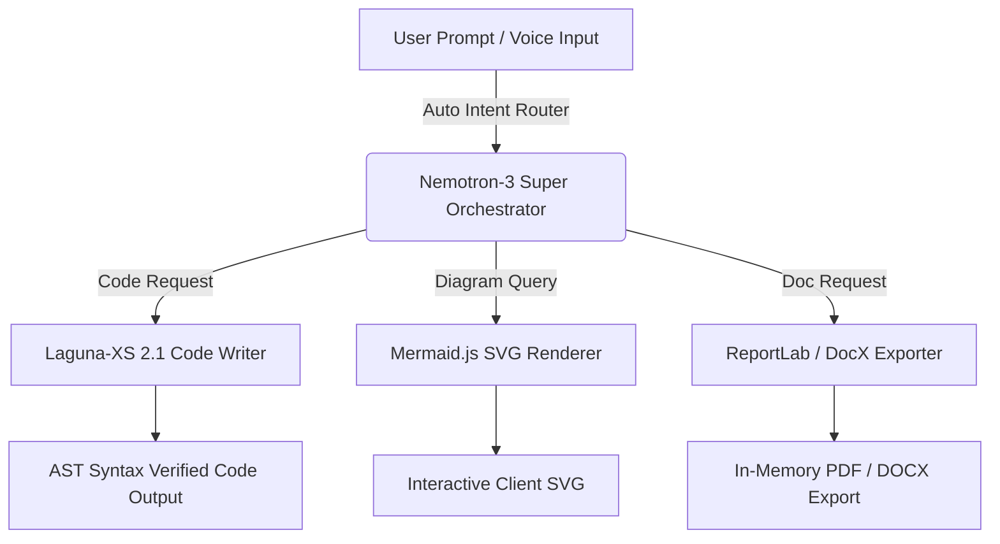

# ⚡ Cognix Studio — The Autonomous Multi-Agent Workstation

<p align="center">
  
</p>

<p align="center">
  <strong>Empowering high-performance workflows through intelligent tool orchestration, static syntax verification, live Mermaid diagrams, and in-memory document exports.</strong>
</p>

<p align="center">
  <a href="https://abhiraj1121.github.io/cognix-studio/"></a>
  <a href="https://abhiraj1121.github.io/cognix"></a>
  <a href="https://github.com/Abhiraj1121/cognix-studio/blob/main/LICENSE"></a>
</p>

---

## 🎨 Overview & Design Aesthetic

**Cognix Studio** is the flagship ecosystem landing workstation for **EKA AI Agent Orchestrator** (hosted at [`abhiraj1121.github.io/cognix-studio/`](https://abhiraj1121.github.io/cognix-studio/)).

Built on the **"Obsidian Glass & Electric Cyan"** design theme, it combines a deep `#030712` obsidian backdrop with radial ambient glows, frosted glass cards (`backdrop-filter: blur(20px)`), dynamic typewriter animations, client-side SVG rendering, and real-time interactive model simulators.

---

## 🚀 Key Features

### 1. 🤖 Autonomous Intent Router (`nvidia/nemotron-3-super-120b`)
- Auto-detects user intent in plain English or Hindi using function calling.
- Automatically routes prompts to specialized tools (code generation, diagram rendering, document building, or avatar generation) without requiring slash commands.

### 2. 💻 Verified Code Writer (`poolside/laguna-xs-2.1`)
- Generates clean, robust Python and polyglot code snippets.
- Incorporates static AST parsing (`ast.parse`) for 100% clean syntax verification with **zero server-side execution risk**.

### 3. 📊 Live Diagram Generator (`Mermaid.js`)
- Converts natural language descriptions into interactive SVG diagrams live inside the browser tab.
- Supports flowcharts, sequence diagrams, class diagrams, and entity-relationship (ER) models.

### 4. 📄 In-Memory Document Exporter (`ReportLab` / `python-docx`)
- Generates reports, resumes, proposals, and developer documentation on demand.
- Supports real-time export to PDF, DOCX, and Markdown formats with graceful fallback.

### 5. 🎤 Bilingual Voice I/O (`Web Speech API`)
- Integrated speech recognition and `SpeechSynthesis` TTS supporting both **English** and **Hindi**.
- Features automated voice frequency soundwave visualizers and custom audio controls.

### 6. 🔑 Zero-Trust BYOK Architecture
- Bring Your Own Key (BYOK) model storing OpenRouter API keys exclusively in the browser's `localStorage`.
- Direct authorization header transmission with zero server-side key logging or credential persistence.

---

## 🛠️ System Architecture & Execution Flow



---

## ⚙️ Technical Stack

| Layer | Technologies & Frameworks |
| :--- | :--- |
| **Backend & Security** | Python 3.11, Flask, Flask-CORS, SQLite3, PBKDF2-HMAC-SHA256 Auth (260k iterations) |
| **AI Core Models** | OpenRouter API, Nemotron-3 Super 120B (Router), Laguna-XS 2.1 (Code), Gemma-4 26B (Vision) |
| **Frontend & UX** | Vanilla JS (ES6+), HTML5, CSS3 Glassmorphism, Web Speech API, SpeechSynthesis, Mermaid.js |
| **Document Engine** | `python-docx`, `reportlab`, `marked.js`, `ast.parse` |

---

## 💻 Local Development & Deployment

### Quick Start (Local Server)
```bash
# Clone the repository
git clone https://github.com/Abhiraj1121/cognix-studio.git

# Navigate into the project folder
cd cognix-studio

# Start a local HTTP server
python -m http.server 8080
```
Open **`http://localhost:8080`** in your browser.

---

## 🧑‍💻 Developer & Creator

**Abhi Raj**  
*Founder of Cognix Studio & Lead Developer of EKA AI Engine*

> Full-stack developer and AI systems architect focused on building intuitive agentic interfaces, resilient backends, and futuristic 3D web applications. Started building apps & websites at age 17, now 19 — developer of EKA and founder of Cognix Studio. Built with curiosity, deployed with confidence.

- **GitHub:** [@Abhiraj1121](https://github.com/Abhiraj1121)
- **Portfolio:** [abhiraj1121.github.io](https://abhiraj1121.github.io)
- **EKA Workspace:** [abhiraj1121.github.io/cognix](https://abhiraj1121.github.io/cognix)
- **Legal & Terms:** [abhiraj1121.github.io/ai-tc/](https://abhiraj1121.github.io/ai-tc/)

---

## 📜 License

Cognix Studio is licensed under the [MIT License](LICENSE). © 2026 Abhi Raj.
